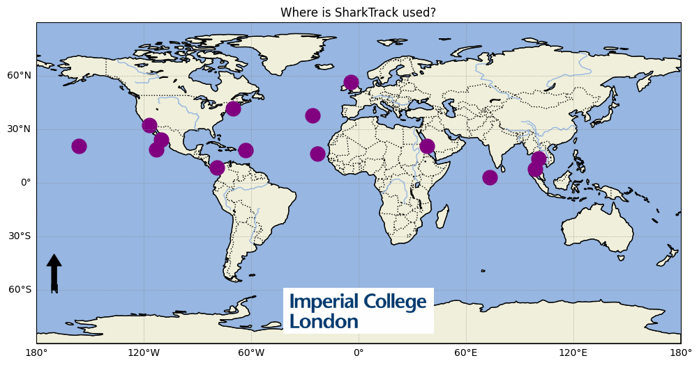

import { Aside } from "@astrojs/starlight/components";

SharkTrack is a software that detects sharks and rays in underwater videos and computes MaxN in 21x faster, with machine learning.

## Where has SharkTrack being used?



1. [Anguilla by University of Exeter and Anguilla National Trust](https://www.linkedin.com/posts/filippo-varini_we-are-back-from-university-of-exeter-activity-7167899292593065985-dZLo?utm_source=share&utm_medium=member_desktop)
2. [Revillagigedo Archipelago, Mexico by Pelagios Kakunja](https://youtu.be/NeBcpscTc3M?si=BfyYM4jQ0-NDCKZZ)
3. La Paz, Mexico by Pelagios Kakunja
4. Northern Gulf of California, Mexico by Pelagios Kakunja
5. Maldives, by the University of Leeds
6. Cabo Verde, by Dr. Francesco Garzon and Adam Whiting of the University of Exeter
7. Red Sea, by Dr. Francesco Garzon, University of Exeter
8. Cape Cod, by the Virginia Tech University
9. Hawaii, by the Virginia Tech University
10. Azores, by the Okeanos Institute of Marine Sciences
11. Bangkok, Thailand by [Metavee Chuangcharoendee from Thai Sharks and Rays](https://www.reshark.org/star-project)
12. Maya Bay, Phi Phi Islands, Thailand AND Koh Tao, Thailand by Scarlett Taylor from Thai Department of Marine and Coastal Resources (DMCR)
13. Scotland, UK by Tash Yates from Edinburgh Napier University
13. Las Perlas Archipelago, Panama by the [Maralliance](https://maralliance.org/) team.

## Quick Trailer

<div>
  <iframe
    width="560"
    height="315"
    src="https://www.youtube.com/embed/NeBcpscTc3M?si=vIklOFr9nRxDDm4w"
    title="YouTube video player"
    frameborder="0"
    allow="accelerometer; autoplay; clipboard-write; encrypted-media; gyroscope; picture-in-picture; web-share"
    referrerpolicy="strict-origin-when-cross-origin"
    allowfullscreen
  ></iframe>
</div>

## Overview

Shark and Ray (Elasmobranch) researchers monitor their populations using Baited Remote Underwater Video Systems (BRUVS). This is a time-consuming process, as each video needs to be manually annotated.

SharkTrack is a Machine Learning model that uses computer vision to detect and track Elasmobranchii in BRUVS videos and compute the MaxN metrics, used by ecologists.

_Therefore SharkTrack is an AI-enhanced workflow to convert raw BRUVS videos to MaxN, which has been tested 21x faster than traditional methods._

## How is it useful

- 🏃‍♀️ Computes MaxN semi-automatically, 21x faster
- 🏝 Can detect any elasmobranch species (as a single 'elasmobranch' class) in any location with 89% accuracy
- 👨‍💻 Can run on a standard laptop - no experience or advanced tech requirement

## How does SharkTrack work?

SharkTrack analyses BRUVS in two steps, as showed below:

_The SharkTrack pipeline to compute MaxN, divided into Step 1 (top) and Step 2 (bottom)_

##### Step 1: Automatic Processing

- (a) Ingests all underwater videos in a hard drive or folder
- (b) Automatically detects elasmobranchs
- (c) Save sightings in a CSV
- (d) Save a screenshot for each detected elasmobranch with video
  
  _Each detection image shows the video and time it was captured_

##### Step 2: Manual Review

- (e) Classify the species of detected elasmobranchs by renaming the relative screenshot filename.
- (f) SharkTrack updates all sightings of detected elasmobranchs with the new species classification
- (g) And outputs the species-specific MaxN

## How it can help you?

- 👀 **Peek Mode** After a day of sampling, run it on your laptop overnight and automatically detect where and when sharks and rays appeared in the videos.
- 🔎 **Analyst Mode** Accurately analyse the footage to derive relative abundance with the MaxN metrics.

Both modes can be run on a standard laptop and do not require WIFI.

Overall, SharkTrack is the most helpful to process videos where elasmobranch appears rarely, as it extracts them from the mainly empty footage, removeing the need to watch it manually.

## How can I run SharkTrack?

SharkTrack is a publicly-available model and you can install and run it by following [this guide](https://github.com/filippovarini/sharktrack/blob/master/sharktrack-user-guide.md).

If you don't have experience with Python, we know it can be daunting but don't fear! By following the guide step-by-step you will have SharkTrack up and running on your videos in less than 10 minutes.

Reach out if have any quesions [here](<(mailto:fppvrn@gmail.com?subject=SharkTrackHelp)>)

## Contributors

This software and related work was supported by the efforts of Filippo Varini, Joel H. Gayford, Jeremy Jenrette, Matthew J. Witt, Francesco Garzon, Francesco Ferretti, Sophie Wilday, Mark E. Bond, Michael R. Heithaus, Danielle Robinson, Devon Carter, Najee Gumbs, Vincent Webster, Ben Glocker, Fabio De Sousa Ribeiro, Rajat Rasal, Orlando Timmerman, Natalie Ng, Rui Wen Lim, Michael Sellgren, Lara Tse, Steven Chen, Maria Pia Donrelas, Manfredi Minervini, Xuen Bei (Bay) Chin, Adam Whiting, Aurora Crocini, Gabriele Bai, Stephanie Guerinfor.

## Collaborations

This repository is licensed with the [MIT license](https://opensource.org/license/mit). If you use SharkTrack, please cite:

Varini, F. et al (2024). SharkTrack. GitHub. Available at
https://github.com/filippovarini/sharktrack

The same citation, in BibTex format:

```BibTex
@article{varini2024sharktrack,
  title={SharkTrack},
  author={Filippo Varini et al},
  year={2024}
}
```

> We update the citation to reference the paper once it has been pubblished.

### Issues

Please submit any issue on [GitHub](https://github.com/filippovarini/sharktrack/issues). We aim to respond to it within a week.

### Contribution

This project welcomes contributions, as pull requests, issues, or suggestions by [email](mailto:fppvrn@gmail.com?subject=SharkTrackContribution).

This is the first step of a broader effort to develop generalisable marine species classifiers. We are looking for contributors for this project. If you want to get involved in AI-driven Ocean Conservation please email us.

## Next Stpes

Run the model on your BRUVS by following [this guide](https://github.com/filippovarini/sharktrack/blob/master/sharktrack-user-guide.md)
