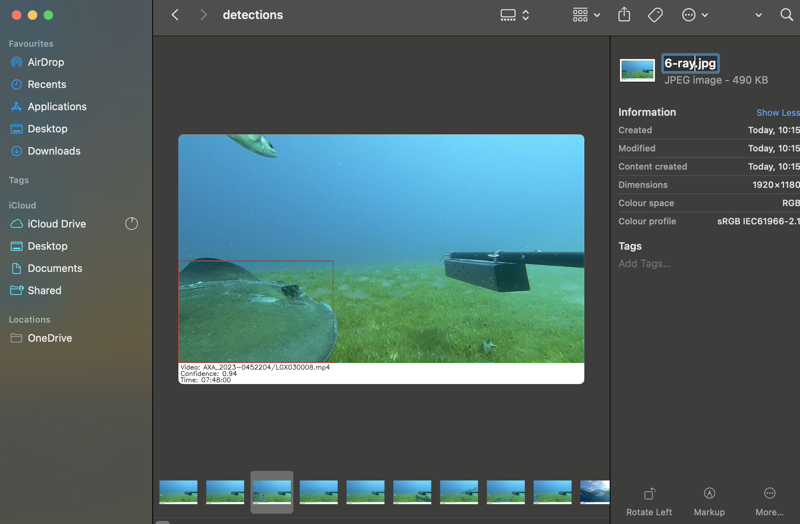

import { Aside, LinkCard } from "@astrojs/starlight/components";

## Overview

After running SharkTrack on your videos, you need to convert the raw output to MaxN metrics. This involves two steps:

1. **Cleaning the Output** — Delete wrong detections and assign species ID to correct ones.
2. **Extract MaxN** — Generate species-specific MaxN from the cleaned output.

<Aside type="tip">
  If you haven't run SharkTrack yet, start with the [User Guide](/sharktrack/user-guide/).
</Aside>

---

## Understand the Output

> **TL;DR:** When SharkTrack detects a shark, it tracks it across frames generating a "Shark Track". Results are saved in `output.csv` and for each track, a frame is stored where it was detected. You only need to validate/classify each shark once — SharkTrack handles the tracking!

Locate your output directory (default: `./output`). It contains:

| File / Folder | Description |
|---|---|
| `output.csv` | Lists each detection at each timeframe for each video |
| `detections/` | For each tracked elasmobranch, the `.jpg` frame where its track achieved highest confidence |
| `overview.csv` | Lists all videos processed and tracks found in each |

{/* TODO: Add a screenshot of a detection example image here */}
{/*  */}

### Output FAQ

<details>
<summary><strong>What is a track?</strong></summary>

The same elasmobranch appears in multiple consecutive frames. A track is a bounding box with an ID saying "this is the same shark I found before."
</details>

<details>
<summary><strong>What is a max-conf-detection?</strong></summary>

Each track is made up of detections at different times, each with a confidence score. The max-conf-detection is the frame/time/bounding box with the highest score — its image is saved in the detection folder.
</details>

<details>
<summary><strong>Why does this matter?</strong></summary>

You only need to process one annotation per track instead of thousands of frames. A script automatically reflects your changes on every detection for the track when computing MaxN.
</details>

<details>
<summary><strong>One frame isn't enough to determine species</strong></summary>

Each detection image shows the video path and time, so you can go back to the original video and use it to assign a species.
</details>

<details>
<summary><strong>I see the same elasmobranch in multiple detections</strong></summary>

The model may split the same shark into two or more consecutive tracks. Classify all of them — this won't affect MaxN accuracy, it just requires classifying more images.
</details>

---

## Cleaning the Output

Here, **detections** are the images showing the highest-confidence detection of each Track.

You need to:
- **Reject** tracks that are not elasmobranchii (delete the file)
- **Assign Species ID** to correct detections (rename the file)

### Understanding Detection Images

Each detection image highlights:
- The tracked elasmobranch with a **thick** bounding box
- Other detections in the same frame with **thin** bounding boxes

{/* TODO: Add detection example images showing thick/thin boxes */}

The thin boxes tell you that those additional sharks have their own detection image in the same folder. If you see a shark with no box around it, the model missed it.

### Cleaning Examples

| Action | When |
|--------|------|
| **Confirm & assign species** | The thick box clearly shows an elasmobranch |
| **Reject (delete)** | The thick box shows something that is not an elasmobranch |
| **Reject (already exists)** | The elasmobranch in the thick box already has its own detection in a thin box |

### Step-by-Step Annotation

1. For each video, open the respective folder. It contains detection files named `{track_id}.jpg`.
2. Scroll through all images and locate the **thick** bounding box (that is the detection you are classifying).
3. **If not an elasmobranch** → Delete the file.
4. **If an elasmobranch** → Rename the file with the species ID, **keeping the original number** separated by a `-`.

**Example:** `1.jpg` → `1-scalloped_hammerhead.jpg`

<Aside type="caution">
  Keep the original `track_id` number and separate it from the species name with a `-`. You can use any species ID naming convention.
</Aside>

{/* TODO: Add screenshot showing the file renaming process */}
{/*  */}

### Pro Tips

- Do a **first pass** to remove all wrong detections, then assign species ID in a **second pass**.
- **Unsure about species/validity?** Check the text at the bottom of the detection image for the video name and timestamp, then review the original video.
- **Windows shortcuts:** `F2` to rename, `Ctrl+D` to delete.
- **macOS shortcuts:** Gallery view, `Cmd+Delete` to remove, `Enter` to rename.

### Collaborating

Want multiple users to annotate? Upload the entire output folder to Google Drive, Dropbox, or OneDrive and perform the cleaning steps there!

---

## Extract MaxN

You have cleaned all annotations — time to generate MaxN!

1. Open Terminal at the `sharktrack` folder (same as when running the model in the [User Guide](/sharktrack/user-guide/))
2. Activate the virtual environment:

**Anaconda:**
```bash
conda activate sharktrack
```

**Windows:**
```bash
venv\Scripts\activate.bat
```

**macOS / Linux:**
```bash
source venv/bin/activate
```

3. Run the MaxN computation:

```bash
python utils/compute_maxn.py --path <output_path>
```

Replace `<output_path>` with the path of the folder containing `output.csv` and all detection folders.

**Example:**
```bash
python utils/compute_maxn.py --path output
```

<Aside type="tip">
  You can optionally provide a path to the original videos to output MaxN `.jpg` frames.
</Aside>

You will see a `maxn.csv` file in the SharkTrack folder.

🚀 **Hooray! You have obtained the MaxN!**

---

## Need Help?

- **Issues:** Submit on [GitHub](https://github.com/filippovarini/sharktrack/issues)
- **Questions:** [Email us](mailto:fppvrn@gmail.com?subject=SharkTrackFAQ)
- **Contributions:** Pull requests, issues, or suggestions welcome — [email](mailto:fppvrn@gmail.com?subject=SharkTrackContribution)

---

## Navigation

<div style="display: grid; grid-template-columns: 1fr 1fr; gap: 1rem;">
  <LinkCard
    title="← User Guide"
    description="Back to installation and running SharkTrack."
    href="/sharktrack/user-guide/"
  />
  <LinkCard
    title="← Overview"
    description="Back to the SharkTrack landing page."
    href="/sharktrack/"
  />
</div>
