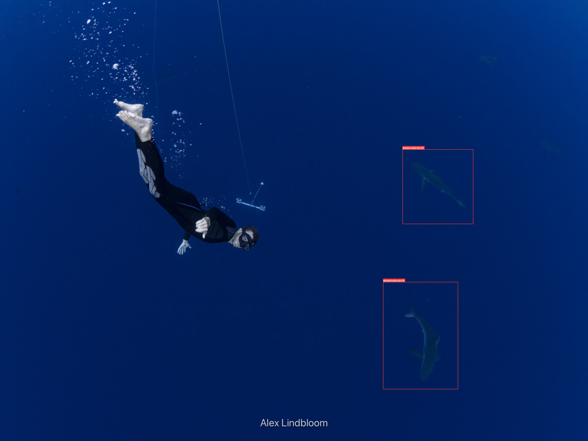
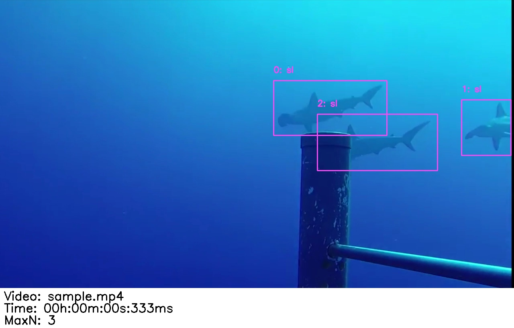

import { Aside, LinkCard } from "@astrojs/starlight/components";

## Overview

After running SharkTrack on your videos, you’ll do two things: **review the output** and then **compute MaxN**.

1. **Review (clean + label)** — Delete false detections and label true detections with a species ID.
2. **Compute MaxN** — Generate species-specific MaxN metrics from your reviewed output.

<Aside type="tip">
  If you haven't run SharkTrack on the videos yet, start with [Step 1: Automatic Processing](/sharktrack/user-guide/).
</Aside>

---

## Understand the Output

> **TL;DR:** SharkTrack groups consecutive detections of the same animal into a **track** (with an ID). For each track, it saves **one** screenshot (`.jpg`) that you can review quickly. Your labels (via filenames) are then used to compute MaxN.

### Output folder structure

Locate your output directory (default: `./output`). It contains:

| File / Folder | Description |
|---|---|
| `internal_results/output.csv` | Raw detections (per frame/time) |
| `internal_results/overview.csv` | Summary per video (number of tracks found) |
| `internal_results/*/` | One subfolder per video |
| `internal_results/*/<track_id>.jpg` | One screenshot per track (this is what you review) |

{/* TODO: Add a screenshot of a detection example image here */}
{/*  */}


### How to read a detection screenshot

In each video folder you will see **one screenshot per track**. The screenshot shows a bounding box around the shark/ray you should label.


The screenshot also shows the video file and timestamp, so you can refer back to the original footage when you’re unsure.

<Aside type="note">
  You might see multiple animals in the frame, but SharkTrack saves one screenshot per track, so you will always see only one bounding box. Only focus on the animal in the bounding box.
</Aside>


---

## Step 1: Review (Clean + Label)

1. For each video, open its output subfolder. It contains detection files named `{track_id}.jpg`.
2. Scroll through the images and focus on the animal inside the bounding box.
3. If it’s not a shark/ray, delete the file.
4. If it is a shark/ray, rename the file from `{track_id}.jpg` to `{track_id}-{species}.jpg`.

**Example:** `5.jpg` → `5-great_hammerhead.jpg`

<Aside type="caution">
  Keep the original `track_id` number at the start of the filename. The MaxN script uses it to match your label back to the track.
</Aside>

<Aside type="note">
  The `{species}` part can be any text. For consistency, prefer lowercase with underscores (e.g. `scalloped_hammerhead`, `manta_ray`, `unknown`).
</Aside>

### FAQ

<details>
<summary><strong>What is a track?</strong></summary>

The same elasmobranch appears in multiple consecutive frames. A track is SharkTrack’s “this is the same animal I saw before” group, with an ID.
</details>

<details>
<summary><strong>Why are there multiple animals in the screenshot, but only one bounding box?</strong></summary>

SharkTrack saves one screenshot per track, so you will always see only one bounding box. Only label the animal in the bounding box.
</details>

<details>
<summary><strong>Why does this matter?</strong></summary>

You only need to label one screenshot per track instead of thousands of frames. The script applies your label to all detections in that track when computing MaxN.
</details>

<details>
<summary><strong>One frame isn't enough to determine species</strong></summary>

Each detection image shows the video name/path and timestamp, so you can go back to the original video to confirm the species.
</details>

<details>
<summary><strong>I see the same elasmobranch in multiple detections</strong></summary>

The model may split the same shark into two or more consecutive tracks. Classify all of them — this won't affect MaxN accuracy, it just requires classifying more images.
</details>


### Pro Tips

- Do a first pass to remove wrong detections, then assign species labels in a second pass.
- **Unsure about species/validity?** Check the text at the bottom of the detection image for the video name and timestamp, then review the original video.
- **Windows shortcuts:** `F2` to rename, `Ctrl+D` to delete.
- **macOS shortcuts:** Gallery view, `Cmd+Delete` to remove, `Enter` to rename.

### Collaborating

Want multiple users to annotate? Upload the entire output folder to Google Drive, Dropbox, or OneDrive and perform the cleaning steps there!

---

## Step 2: Compute MaxN

Once you have reviewed all track screenshots, it's time to generate MaxN.

1. Open Terminal at the `sharktrack` folder (same as when running the model in the [User Guide](/sharktrack/user-guide/))
2. Activate the virtual environment:

**Anaconda:**
```bash
conda activate sharktrack
```

**Windows:**
```bash
venv\Scripts\activate.bat
```

**macOS / Linux:**
```bash
source venv/bin/activate
```

3. Run the MaxN computation:

```bash
python utils/compute_maxn.py
```

You will be asked for:
- the path to your output folder (the one you just reviewed)
- the path to the folder containing the original videos (optional, used to compute visualisations)

> You will see a new folder called **`analysed`**, with the `maxn.csv` file, as well as subfolders showing you the visualisations of MaxN per each video.



<Aside type="tip">
  If a result looks off, go back to Step 1 and double-check the track screenshots for that video (especially borderline false positives).
</Aside>

---

## Need Help?

- **Issues:** Submit on [GitHub](https://github.com/filippovarini/sharktrack/issues)
- **Questions:** [Email us](mailto:fppvrn@gmail.com?subject=SharkTrackFAQ)
- **Contributions:** Pull requests, issues, or suggestions welcome — [email](mailto:fppvrn@gmail.com?subject=SharkTrackContribution)

---

## Now Jump to the Code!

<LinkCard
  title="GitHub"
  description="Access the code and model."
  href="https://github.com/filippovarini/sharktrack"
  target="_blank"
/>
