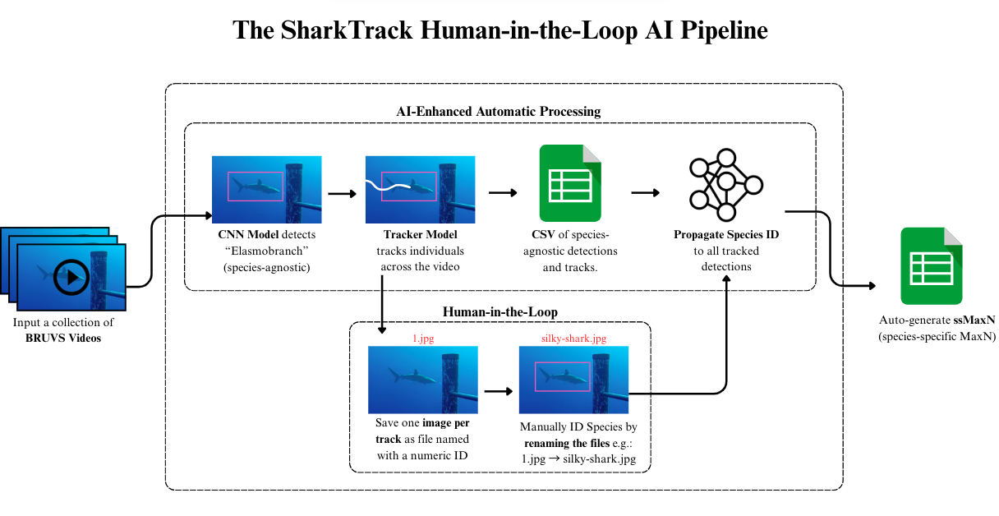

import VideoHero from "../../../components/sharktrack/VideoHero.astro";
import GlobeMap from "../../../components/sharktrack/GlobeMap.astro";
import FeatureCard from "../../../components/sharktrack/FeatureCard.astro";
import SectionNav from "../../../components/sharktrack/SectionNav.astro";

{/* ── Floating section navigation (appears on scroll) ── */}
<SectionNav sections={[
  { id: "overview", label: "Overview" },
  { id: "users-worldwide", label: "Users Worldwide" },
  { id: "how-does-it-work", label: "How It Works" },
  { id: "get-started", label: "Get Started" },
  { id: "publication", label: "Publication" },
  { id: "contributors", label: "Contributors" },
]} />

{/* ── Hero with video background ── */}
<VideoHero
  title="SharkTrack"
  tagline="A software that detects sharks and rays in underwater videos and computes MaxN 21x faster, with machine learning."
>
  <a href="/sharktrack/user-guide/" class="st-btn st-btn--primary">Get Started</a>
  <a href="https://github.com/filippovarini/sharktrack" class="st-btn st-btn--secondary" target="_blank">GitHub</a>
</VideoHero>

{/* ── Main content sections ── */}
<div class="st-content">

<section id="overview">

## What is SharkTrack?

To protect sharks and rays, scientists and conservationists monitor their populations with underwater videos (i.e. BRUVS, RUVS, ROVs).  This process requires them to manually analyse 1000s of hours of videos, which is extremely time-consuming.

SharkTrack is an AI-enhanced video annotation pipeline that uses computer vision to detect and track sharks/rays in BRUVS videos and computes ecology metrics (MaxN), used by ecologists.

We tested the performance of SharkTrack in [Varini et al 2024](https://www.arxiv.org/abs/2407.20623) and found out that:

<div class="feature-grid">
  <FeatureCard
    icon="🏃‍♀️"
    title="21x Faster"
    description="Computes MaxN semi-automatically, 21 times faster than manual annotation."
  />
  <FeatureCard
    icon="🌍"
    title="89% Accuracy"
    description="At detecting shark/ray in unseen locations as a single 'elasmobranch' class."
  />
  <FeatureCard
    icon="💻"
    title="Runs Anywhere"
    description="Works on a standard laptop — no experience or advanced tech requirements needed."
  />
</div>

</section>

{/* ── Interactive Globe Map ── */}
<section id="users-worldwide">
  <GlobeMap />
</section>

<section id="how-does-it-work">

## How Does It Work?

SharkTrack analyses BRUVS in two steps:



### Step 1: Automatic Processing

- **(a)** Ingests all underwater videos in a hard drive or folder
- **(b)** Automatically detects and tracks elasmobranchs
- **(c)** Saves sightings in a CSV
- **(d)** Saves a screenshot for each detected elasmobranch


### Step 2: Manual Review
Scroll through the screenshot (detected individuals) and:
- **(e)** Delete false detections (i.e. algae, trash)
- **(f)** Classify the species of detected elasmobranchs by renaming the screenshot filename
- **(g)** With a script, SharkTrack updates all sightings with the new species classifications and outputs the species-specific MaxN

### Two Modes

- **🔎 Analyst Mode** — Detect and track sharks in the videos. Use it to derive relative abundance with MaxN metrics.
- **👀 Peek Mode** — Just detect sharks in videos. Use it for faster analysis but without tracking or MaxN computations downstream.

Both modes run on a standard laptop and do not require WiFi.

</section>

<section id="get-started">

## Get Started

SharkTrack is publicly available and free to use. Follow our step-by-step guides:

<div class="guide-links">
  <a href="/sharktrack/user-guide/" class="guide-card">
    <span class="guide-card__icon">📙</span>
    <span class="guide-card__title">Documentation</span>
    <span class="guide-card__desc">Follow the guide to run SharkTrack and analyze the videos (10m)</span>
  </a>
</div>

If you don't have experience with Python, don't fear! By following the guide step-by-step you will have SharkTrack up and running in less than 10 minutes.

[Contact us](mailto:fppvrn@gmail.com?subject=SharkTrackHelp) if you have any questions.

</section>

<section id="publication">

## Publication

If you use SharkTrack, please cite:

> Varini, F. et al (2024). SharkTrack. GitHub. Available at
> [https://github.com/filippovarini/sharktrack](https://github.com/filippovarini/sharktrack)

```bibtex
@article{varini2024sharktrack,
  title={SharkTrack},
  author={Filippo Varini et al},
  year={2024}
}
```

This repository is licensed with the [MIT License](https://opensource.org/license/mit).

Please submit any issue on [GitHub](https://github.com/filippovarini/sharktrack/issues). We aim to respond within a week.

</section>

<section id="contributors">

## Contributors

This software and related work was supported by the efforts of Filippo Varini, Joel H. Gayford, Jeremy Jenrette, Matthew J. Witt, Francesco Garzon, Francesco Ferretti, Sophie Wilday, Mark E. Bond, Michael R. Heithaus, Danielle Robinson, Devon Carter, Najee Gumbs, Vincent Webster, Ben Glocker, Fabio De Sousa Ribeiro, Rajat Rasal, Orlando Timmerman, Natalie Ng, Rui Wen Lim, Michael Sellgren, Lara Tse, Steven Chen, Maria Pia Donrelas, Manfredi Minervini, Xuen Bei (Bay) Chin, Adam Whiting, Aurora Crocini, Gabriele Bai, Stephanie Guerinfor.

### Contribution

This project welcomes contributions as pull requests, issues, or suggestions by [email](mailto:fppvrn@gmail.com?subject=SharkTrackContribution).

This is the first step of a broader effort to develop generalisable marine species classifiers. We are looking for contributors for this project. If you want to get involved in AI-driven Ocean Conservation please email us.

</section>

</div>
