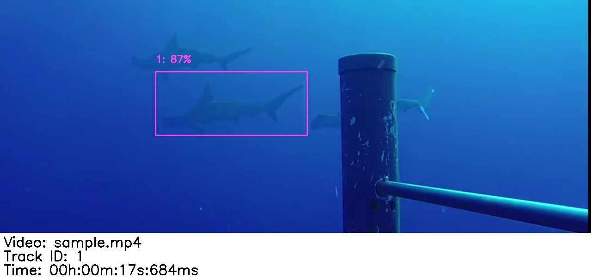

import VideoHero from "../../../components/sharktrack/VideoHero.astro";
import GlobeMap from "../../../components/sharktrack/GlobeMap.astro";
import FeatureCard from "../../../components/sharktrack/FeatureCard.astro";
import SectionNav from "../../../components/sharktrack/SectionNav.astro";

{/* ── Floating section navigation (appears on scroll) ── */}
<SectionNav sections={[
  { id: "users-worldwide", label: "Users Worldwide" },
  { id: "overview", label: "Overview" },
  { id: "features", label: "Features" },
  { id: "how-does-it-work", label: "How It Works" },
  { id: "get-started", label: "Get Started" },
  { id: "publication", label: "Publication" },
  { id: "contributors", label: "Contributors" },
]} />

{/* ── Hero with video background ── */}
<VideoHero
  title="SharkTrack"
  tagline="A software that detects sharks and rays in underwater videos and computes MaxN 21x faster, with machine learning."
>
  <a href="#overview" class="st-btn st-btn--primary">Learn</a>
  <a href="/sharktrack/user-guide/" class="st-btn st-btn--secondary">Get Started</a>
</VideoHero>

{/* ── Interactive Globe Map ── */}
<GlobeMap />

{/* ── Main content sections ── */}
<div class="st-content">

<section id="overview">

## Overview

Shark and Ray (Elasmobranch) researchers monitor their populations using Baited Remote Underwater Video Systems (BRUVS). This is a time-consuming process, as each video needs to be manually annotated.

SharkTrack is a Machine Learning model that uses computer vision to detect and track Elasmobranchii in BRUVS videos and compute the MaxN metrics, used by ecologists.

> SharkTrack is an AI-enhanced workflow to convert raw BRUVS videos to MaxN, which has been tested **21x faster** than traditional methods.

</section>

<section id="features">

## Features

<div class="feature-grid">
  <FeatureCard
    icon="🏃‍♀️"
    title="21x Faster"
    description="Computes MaxN semi-automatically, 21 times faster than manual annotation."
  />
  <FeatureCard
    icon="🌍"
    title="89% Accuracy"
    description="Detects any elasmobranch species in any location as a single 'elasmobranch' class."
  />
  <FeatureCard
    icon="💻"
    title="Runs Anywhere"
    description="Works on a standard laptop — no experience or advanced tech requirements needed."
  />
</div>

</section>

<section id="how-does-it-work">

## How Does It Work?

SharkTrack analyses BRUVS in two steps:

{/* TODO: Uncomment and adjust path once you have the pipeline figure image */}
{/*  */}

### Step 1: Automatic Processing

- **(a)** Ingests all underwater videos in a hard drive or folder
- **(b)** Automatically detects elasmobranchs
- **(c)** Saves sightings in a CSV
- **(d)** Saves a screenshot for each detected elasmobranch

{/* TODO: Uncomment and adjust path once you have the detection example image */}
{/*  */}

### Step 2: Manual Review

- **(e)** Classify the species of detected elasmobranchs by renaming the screenshot filename
- **(f)** SharkTrack updates all sightings with the new species classification
- **(g)** Outputs the species-specific MaxN

### Two Modes

- **👀 Peek Mode** — Run it overnight after a day of sampling. Automatically detect where and when sharks and rays appeared.
- **🔎 Analyst Mode** — Accurately analyse footage to derive relative abundance with MaxN metrics.

Both modes run on a standard laptop and do not require WiFi.

</section>

<section id="get-started">

## Get Started

SharkTrack is publicly available and free to use. Follow our step-by-step guides:

<div class="guide-links">
  <a href="/sharktrack/user-guide/" class="guide-card">
    <span class="guide-card__icon">📥</span>
    <span class="guide-card__title">User Guide</span>
    <span class="guide-card__desc">Install and run SharkTrack on your BRUVS videos</span>
  </a>
  <a href="/sharktrack/annotation-pipeline/" class="guide-card">
    <span class="guide-card__icon">📊</span>
    <span class="guide-card__title">Annotation Pipeline</span>
    <span class="guide-card__desc">Review output and compute species-specific MaxN metrics</span>
  </a>
</div>

If you don't have experience with Python, don't fear! By following the guide step-by-step you will have SharkTrack up and running in less than 10 minutes.

[Contact us](mailto:fppvrn@gmail.com?subject=SharkTrackHelp) if you have any questions.

</section>

<section id="publication">

## Publication

If you use SharkTrack, please cite:

> Varini, F. et al (2024). SharkTrack. GitHub. Available at
> [https://github.com/filippovarini/sharktrack](https://github.com/filippovarini/sharktrack)

```bibtex
@article{varini2024sharktrack,
  title={SharkTrack},
  author={Filippo Varini et al},
  year={2024}
}
```

This repository is licensed with the [MIT License](https://opensource.org/license/mit).

Please submit any issue on [GitHub](https://github.com/filippovarini/sharktrack/issues). We aim to respond within a week.

</section>

<section id="contributors">

## Contributors

This software and related work was supported by the efforts of Filippo Varini, Joel H. Gayford, Jeremy Jenrette, Matthew J. Witt, Francesco Garzon, Francesco Ferretti, Sophie Wilday, Mark E. Bond, Michael R. Heithaus, Danielle Robinson, Devon Carter, Najee Gumbs, Vincent Webster, Ben Glocker, Fabio De Sousa Ribeiro, Rajat Rasal, Orlando Timmerman, Natalie Ng, Rui Wen Lim, Michael Sellgren, Lara Tse, Steven Chen, Maria Pia Donrelas, Manfredi Minervini, Xuen Bei (Bay) Chin, Adam Whiting, Aurora Crocini, Gabriele Bai, Stephanie Guerinfor.

### Contribution

This project welcomes contributions as pull requests, issues, or suggestions by [email](mailto:fppvrn@gmail.com?subject=SharkTrackContribution).

This is the first step of a broader effort to develop generalisable marine species classifiers. We are looking for contributors for this project. If you want to get involved in AI-driven Ocean Conservation please email us.

</section>

</div>
